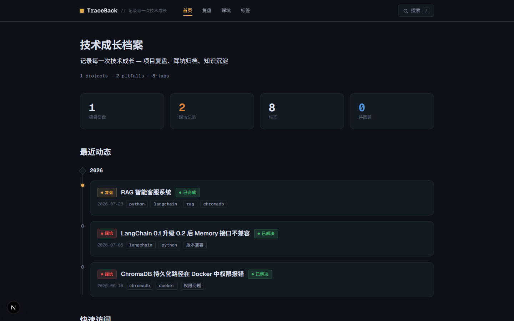
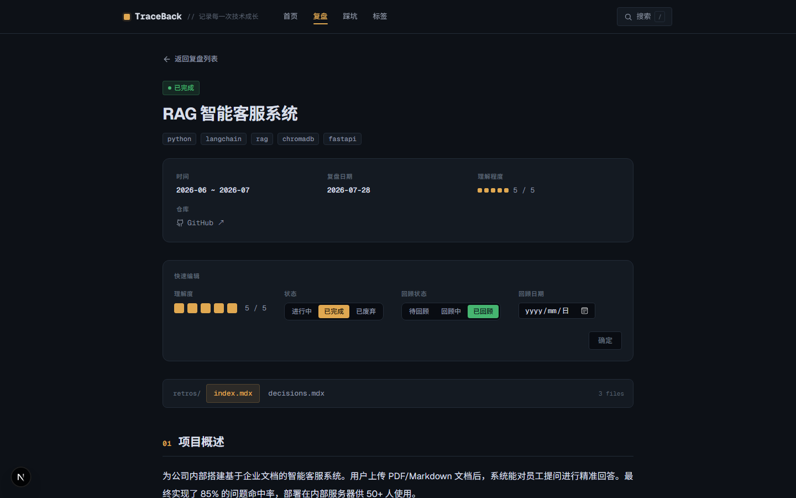
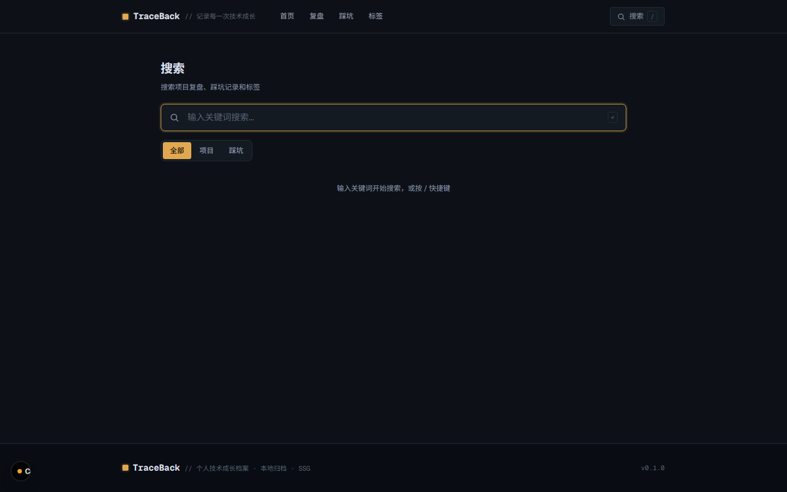
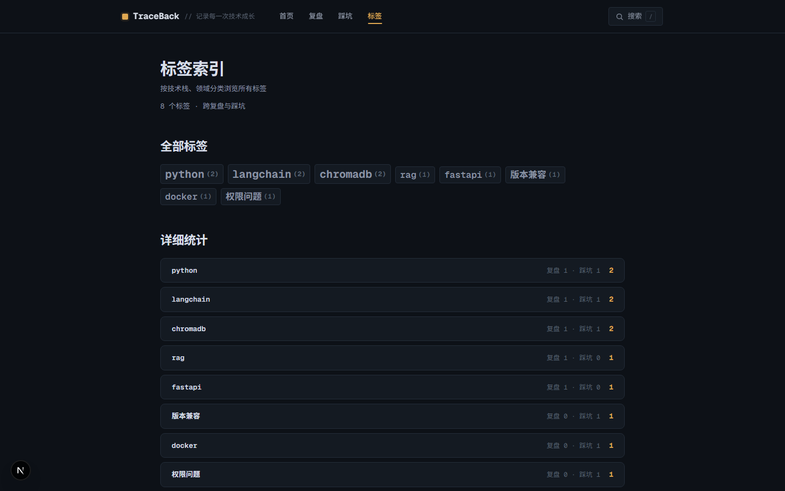
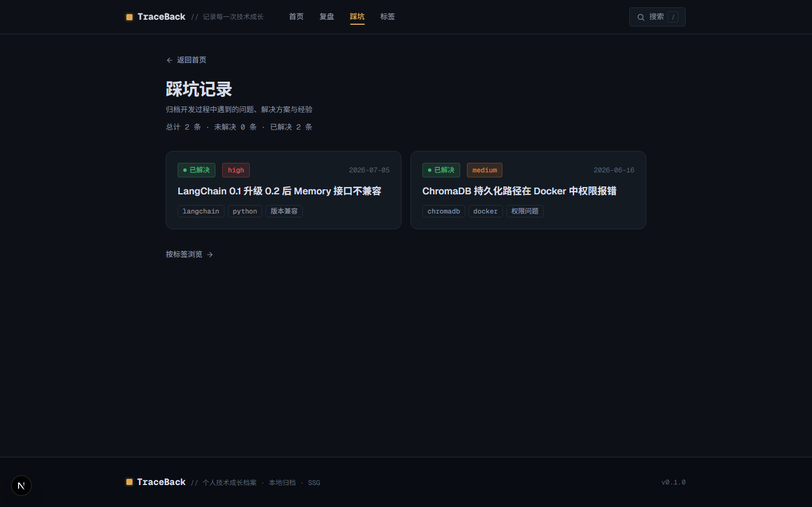
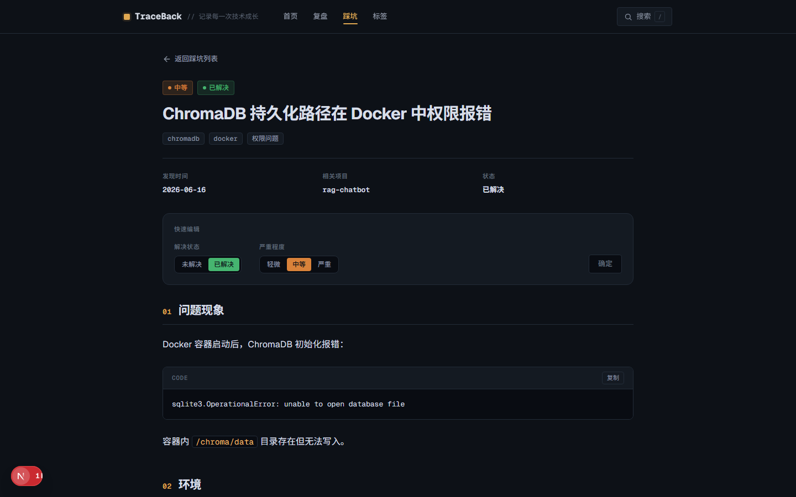

# TraceBack · 项目复盘系统

> 做完项目不遗忘 —— AI 协作生成结构化复盘，踩坑独立归档，全文搜索秒级回溯，到期自动提醒回顾。

[](https://nextjs.org/)
[](https://react.dev/)
[](https://www.typescriptlang.org/)
[](https://tailwindcss.com/)
[](https://mdxjs.com/)
[](LICENSE)

个人开发者专用的项目复盘与技术成长追踪系统：项目做完后沉淀成结构化复盘，几个月后回来快速回忆全貌，遇到相似问题时搜到历史解法。所有内容为标准 MDX 纯文本，任何编辑器可打开，核心依赖仅 4 个，换框架零迁移成本。

---

## 界面预览

| 首页 · 仪表盘与时间线 | 复盘详情 · 五维度正文 + 快速编辑 |
| :---: | :---: |
|  |  |
| 全文搜索 · Fuse.js 加权 + 搜索历史 | 标签聚合 · 跨内容主题串联 |
|  |  |
| 踩坑列表 · 独立问题库 | 踩坑详情 · 六段式 + 快速编辑 |
|  |  |

## 特性

**📋 结构化复盘** — 项目五维度（项目概述 / 技术要点 / AI 协作记录 / 踩坑与解决 / 我学到了什么）+ 里程碑记录 + 技术决策（ADR-lite）+ AI 协作深度记录，模板语义明确，专为 AI 生成设计。

**🕳️ 独立踩坑库** — 技术问题独立收录（问题现象 → 环境 → 排查过程 → 根因 → 解决方案 → 预防），与项目无关的坑也能归档、搜索、复用。

**🔍 三种内容浏览方式**
- 时间线：首页按年份浏览全部动态
- 全文搜索：Fuse.js 加权（标题 3 > 标签 2 > 摘要 1.5 > 正文 1），中文友好，带搜索历史
- 标签聚合：同一标签下的复盘 + 踩坑聚在一起，跨内容串联知识

**✏️ 前端快速编辑** — 理解度、项目状态、回顾状态在详情页直接修改（PATCH 写回 frontmatter），无需手改文件。

**⏰ 待回顾闭环** — 设置回顾日期 → 到期首页提醒 → 标记已回顾自动退出并清空日期，让知识真正内化。

**⌨️ 快捷键** — 任意页面按 `/` 直达搜索框。

**📄 纯文本原则** — 内容为标准 MDX（YAML frontmatter + Markdown），不依赖任何运行时服务，Obsidian / Vim / 任何编辑器都能打开，最坏情况换框架零迁移成本。

## 技术栈

| 层 | 选型 |
|---|---|
| 框架 | Next.js 16（App Router，页面 SSG） |
| UI | React 19 · TypeScript · Tailwind CSS 4（深色主题 + 琥珀品牌色） |
| 内容 | MDX · gray-matter（frontmatter 解析）· next-mdx-remote（渲染） |
| 搜索 | fuse.js（客户端全文搜索，零外部依赖） |

## 快速开始

```bash
npm install
npm run dev      # 开发：http://localhost:3000
npm run build    # 构建（先生成搜索索引，再 next build）
```

## 使用教程

### 核心工作流（三步）

1. **项目做完** → 把项目背景、关键代码与决策丢给 AI，用 `guides/AI-PROMPT.md` 的模板让 AI 生成结构化复盘
2. **归档** → 复盘文件放入 `content/retros/{年份}/{slug}/`（slug 用小写英文连字符），页面自动渲染，无需任何手动注册
3. **沉淀** → 随时回来：首页时间线回忆项目全貌，搜索找历史解法，标签串联同类知识

### 创建一篇复盘

```
content/retros/2026/rag-chatbot/
├── index.mdx            # [必填] frontmatter + 五维度正文
├── logs/                # [选填] 里程碑记录（YYYY-MM-DD-标题.mdx）
├── decisions.mdx        # [选填] 技术决策（ADR-lite 格式）
└── ai-collaboration.mdx # [选填] AI 协作深度记录
```

`index.mdx` frontmatter 核心字段：`title` / `date` / `status`（ongoing｜completed｜abandoned）/ `tags` / `summary` / `understanding_score`（1-5）/ `review_after`（回顾日期）。

### 记录一条踩坑

单文件制，放入 `content/pitfalls/{年份}/`，命名 `YYYY-MM-DD-问题简述.mdx`，正文按六段式组织：问题现象 → 环境 → 排查过程 → 根因 → 解决方案 → 预防/备忘。

### 日常使用

- **前端快速编辑**：详情页直接改理解度、状态、回顾状态，点「确定」提交自动刷新，无需手改文件
- **待回顾闭环**：设置回顾日期 → 到期首页提醒 → 标记「已回顾」自动退出
- **搜索**：任意页面按 `/` 直达搜索框；提交过的搜索词自动记录，方便回查

完整的写作规范见 `guides/WRITING-GUIDE.md`，AI 复盘生成模板见 `guides/AI-PROMPT.md`。

## 目录结构

```
content/
├── retros/{year}/{slug}/   # 项目复盘（文件夹制：index.mdx + logs/ + decisions.mdx + ai-collaboration.mdx）
└── pitfalls/{year}/        # 踩坑记录（单文件制：YYYY-MM-DD-简述.mdx）

guides/                     # 系统操作指南（AI-PROMPT / WRITING-GUIDE / UI-DESIGN-PROMPT）
src/app/                    # 页面与 API（App Router）
scripts/                    # 构建脚本（搜索索引生成）
```

## 内容说明

`content/` 中的内容为示例数据，仅用于演示，可随意删除。

## License

[MIT](LICENSE)
